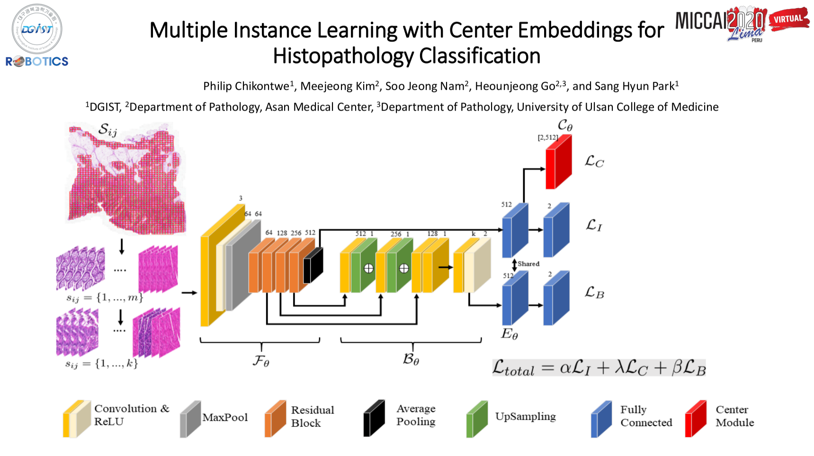

## Multiple Instance Learning with Center Embeddings for Histopathology Classification. MICCAI 2020

This code provides a PyTorch implementation [our paper](https://link.springer.com/chapter/10.1007/978-3-030-59722-1_50).

<div align="center">

</div>

## Highlights
- We propose an end-to-end model for weakly supervised histopathology classification able to assign correct instance and bag labels.
- We show that center loss can improve bag feature learning and also reduce ambiguity in instance labels.
- By jointly considering instance based-MIL (i.e. accurate instance level predictions) and embedding-based MIL, our method shows improved classication performance with reduced false positives.
- Experimental results on two datasets further show that our approach is comparable in performance to methods that learn separate bag-level classifiers and use attention mechanisms for instance selection.


## Requirements
- Python 3.6
- [PyTorch](http://pytorch.org) install = 1.6.0
- torchvision
- CUDA 10.1
- openslide_python
- tensorboardX
- Other dependencies: opencv-python, scipy, pandas, numpy, scipy

See requirements file for more details. 

## Preprocessing 
This is highly dependent on the format of annotations (if present) or slide types (including magnification and others.). In general, its important to preprocess the slides and select candidate patch locations to extract. For this work, we extracted tissue regions per slide (x40) based on Otsu at level 6 and used the regions to select patch co-ordinates (centered per mpp) with atleast 60% tissue area. We recommend checking out [histomicsTk](https://digitalslidearchive.github.io/HistomicsTK/examples/simple_tissue_detection.html) for tissue extraction. 

Ensure you have the WSI split files (train|val|test) with full paths of WSI and xml annotations (for sanity checks later i.e., segmentation | though not used).
e.g. TRAIN_MSS.txt, TRAIN_MSS.txt ...
```
TRAIN_MSI.txt/
-- /path/to/WSI_ID1.(tif,svs)
-- /path/to/WSI_ID1_annot.(xml)
```
After preprocessing tissue regions, we save each slide's information in a dictionary object. We choose this approach to avoid saving all patches to disk. For example:
```python
torch_files = []

# wsi_file: full patch of the WSI file. 
# target  : the actual slide-level label e.g. 0,1,2 and so on. 
# grid    : is a list of all the sampled patch co-ordinates for the slide

# This is done for one class
for wsi_file, class_id in zip(list_of_wsis, wsi_labels):
    points = some_method_to_get_valid_points(wsi_file)
    torch_files.append({
            "slide"  : wsi_file,
            "grid"   : points,
            "target" : class_id }
            )
#
torch.save(torch_files,/path/to/save/lib/test_mss.pth)
```
Note: Ensure that your sampled co-ordinates are level agnostic. This way, one can explore using different level in training or inference.

Save the above formated library for train, validation and testing. e.g, train_{class_name1}\.pth, train_{class_name2}\.pth. The library files contrain all the slides for that particular class following the format above. Now, to create the final library containing all classes, you can simply concatenate them for all splits as shown below:  


```python
import torch, os   
# path to where libs are saved for test (i.e. test_mss.pth
# and test_msi.pth)
amc_root  = '/path/to/root/test'

# amc test creation
# load mss and msi libs
mss_file = torch.load(os.path.join(amc_root,'test_mss.pth'))
msi_file = torch.load(os.path.join(amc_root,'test_msi.pth'))
torch.save({'mss': mss_file, 'msi': msi_file}, 
os.path.join(amc_root,'test_lib.pth'))
print()
```

Note: It is standard practice to normalize the staining of patches for both training and inference, though not applied in the case. We found that depending on the chosen technique, training can take more time. Thus, one could use color jittering as an alternative. 
 
## Training and Inference
We organized the code to a somewhat modular. You will notice separation of models, loaders, utilities and so on. The code has the following structure:
```bash
research_mil/   
    |_ configs
        |_ configuration files for train, inference, loading etc. 
    |_ data
        |_ saved train_lib.pth, val_lib.pth, and test_lib.pth files
    |_ evaluators
        |_ code for testing
    |_ loaders
        |_ data loading classes
    |_ models
        |_ model definitions for pooling, and bag level inference
    |_ trainers
        |_ model training and validation
    |_ utils
        |_ some several useful functions

    train.py # general training script
    test.py  # general testing script

```

The naming convention is rather self-explanatory. To train or test, please see the configuration file where settings should be modified based on ones file structure. To run the model, a config file should be passed to the train or test scripts. 

```bash
   python research_mil/train.py --config research_mil/configs/someconfig.yml
   python research_mil/test.py --config research_mil/configs/someconfig.yml
```

In the implemented trainer scripts (See, trainers/globaltaskmil_trainer.py - aggregation method) we explored using the bag embedding with soft-assignment or bag classifier for validation. In the current implementation, we simply commented out the option of choice. Similarly, the test script in evaluators has the behaviour. You can simply uncomment to use the desired inference method. 


### CenterLoss 

The center embedder was implemented as separate learnable module following the original work. Its important to ensure that whatever weighting is applied during optimization of all losses is corrected as part of the backpropagation step. (See. trainer code)

### See also 
Thanks to works below for their implementations which were useful for this work. 

[MIL_Nature](https://github.com/MSKCCComputational-\
Pathology/MIL-nature-medicine-2019): Implementation of MIL for WSI in Nature Medicine.

[Deep Attention MIL](https://github.com/AMLab-Amsterdam/AttentionDeepMIL) Implementation of ICML Deep attention based MIL

[TwoStage MIL](https://github.com/ImagingLab/ICIAR2018) Implementation of the Two-Step method for ICIAR'18 Challenge

[Survery on WSI MIL methods](https://github.com/jeromerony/survey_wsl_histology): Implementation of different MIL methods in the Survey of Weakly supervised MIL methods paper

## Citation
If you find this repository useful in your research, please cite:
```
@inproceedings{chikontwe2020multiple,
  title={Multiple Instance Learning with Center Embeddings for Histopathology Classification},
  author={Chikontwe, Philip and Kim, Meejeong and Nam, Soo Jeong and Go, Heounjeong and Park, Sang Hyun},
  booktitle={International Conference on Medical Image Computing and Computer-Assisted Intervention},
  pages={519--528},
  year={2020},
  organization={Springer}
}
```

For further any inquires, feel free to reach me at chamaphilip@gmail.com or post an issue here. 